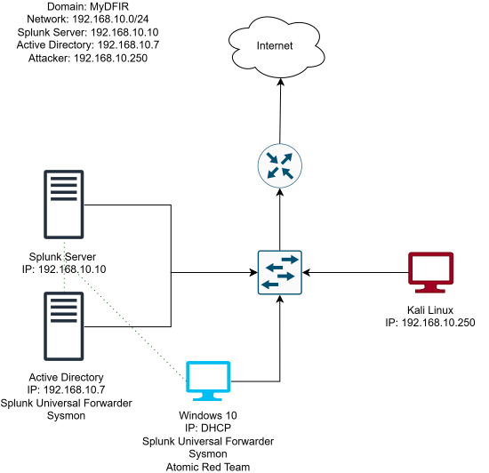

# Active Directory Home Lab: Domain Setup, SIEM Logging, and Attack Detection

A virtualized enterprise environment built in VirtualBox to practice Active Directory administration, endpoint logging with Sysmon, log analysis in Splunk, and detecting a simulated brute-force attack.

> **Note:** This lab was completed by following the [myDFIR Active Directory Project series](https://www.youtube.com/playlist?list=PLGrcVHQv6mp-_5jY1XU1SJ3tjoUMrTI7E). The write-ups here are my own documentation of the build, including my configuration values, screenshots, and what I learned along the way.

## Network Diagram

## Lab Environment

| Machine | OS | Role | IP Address |
|---|---|---|---|
| ADDC01 | Windows Server 2022 | Domain controller (`mydfir.local`), Sysmon, Splunk UF | 192.168.10.7 (static) |
| Target-PC | Windows 10 Pro | Domain-joined endpoint, Sysmon, Splunk UF, Atomic Red Team | 192.168.10.100 (static) |
| splunk | Ubuntu Server 26.04 | Splunk Enterprise (SIEM) | 192.168.10.10 (static) |
| kali | Kali Linux | Attacker machine | 192.168.10.250 (static) |

**Network:** VirtualBox NAT Network `ad-project` (192.168.10.0/24)
**Domain:** `mydfir.local`

## Tools Used

VirtualBox, Windows Server 2022, Active Directory Domain Services, Windows 10, Ubuntu Server, Splunk Enterprise, Splunk Universal Forwarder, Sysmon, Kali Linux, Crowbar, Atomic Red Team, MITRE ATT&CK, draw.io

## Skills Demonstrated

- Virtualization and virtual network configuration (NAT networks, static IPs, DNS)
- Active Directory administration: installing AD DS, promoting a domain controller, creating OUs and users, joining a machine to a domain
- Endpoint telemetry with Sysmon and Splunk Universal Forwarder (`inputs.conf`)
- Splunk indexing, receiving ports, and SPL searches
- Log analysis using Windows Event IDs (4624, 4625)
- Simulating attacks and mapping activity to MITRE ATT&CK techniques
- Identifying detection gaps
- Troubleshooting (DNS resolution, service permissions, VirtualBox issues)

## Walkthrough

1. [Planning and Network Diagram](docs/01-planning-and-diagram.md)
2. [Virtual Machine Setup](docs/02-vm-setup.md)
3. [Splunk and Sysmon Configuration](docs/03-splunk-and-sysmon.md)
4. [Active Directory Setup and Domain Join](docs/04-active-directory.md)
5. [Attack Simulation and Detection](docs/05-attack-and-detection.md)
6. [Troubleshooting Log](docs/06-troubleshooting.md)

## Key Findings

- The simulated RDP brute-force attack generated **20 failed logons (Event ID 4625)** in the same second, followed by **one successful logon (4624)** whose workstation name and source IP matched the Kali machine.
- Atomic Red Team's local account creation test (T1136.001) initially produced no events in Splunk, exposing a **gap in detection visibility** in the default logging setup.
- Learned that Splunk Universal Forwarder configuration changes (like inputs.conf) should always be made in the local/ directory rather than default/ because editing default/ directly risks breaking the base config, while local/ overrides it safely and can be reverted without reinstalling.

## Reflection

The hardest part of this lab wasn't the Active Directory concepts themselves, but the networking and troubleshooting around them, as in getting the Splunk Universal Forwarder to actually send Windows Event Logs took up a lot of time, since the forwarder connected to the indexer successfully but the events were still not showing up. This taught me to check each layer separately (network connectivity, the receiving port, the index itself, and the input configuration) rather than assuming one fix solves everything. The thing that really clicked was seeing the Brute Force attack from Kali Linux show up in the Splunk as a clear pattern of Event ID 4625 failures followed by a single 4624 success, which made the idea of "detection of attack behaviors through logs" more clear. I also learned firsthand how disruptive a failed domain join can be after I hit a BSOD that forced me to rebuild the Target VM from the start, which taught me to always create snapshots before making major changes. If I continued to build through this lab, I would want to add some more attack scenarios using Atomic Red Team to test detection gaps across different MITRE ATT&CK techniques, and eventually build the Splunk alerts/dashboards so that those detections are automatic rather than through manual searches. 

## Disclaimer

All attacks were performed against machines I own inside an isolated lab environment, for educational purposes only.
