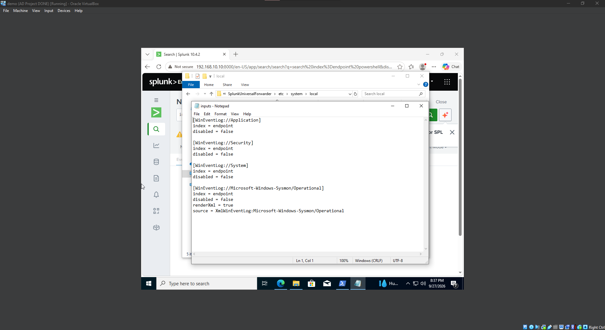

# 03: Splunk and Sysmon Configuration

## Goal
Collect endpoint telemetry with Sysmon and forward it to a Splunk server.

## 1. Network Setup
- Created a VirtualBox **NAT Network** named `ad-project` (`192.168.10.0/24`, DHCP enabled)
- Attached all four VMs to it

## 2. Splunk Server (Ubuntu)
- Set a static IP with Netplan (`/etc/netplan/`): address `192.168.10.10/24`, gateway `192.168.10.1`, DNS `8.8.8.8`, then `sudo netplan apply`
- Verified connectivity with `ping google.com`
- Installed VirtualBox Guest Additions, added my user to the `vboxsf` group, and mounted a shared folder to transfer the installer
- Installed Splunk Enterprise: `sudo dpkg -i <splunk>.deb`
- Started Splunk as the `splunk` user and enabled start on boot:
  ```bash
  sudo -u splunk bash
  /opt/splunk/bin/splunk start
  exit
  sudo /opt/splunk/bin/splunk enable boot-start -user splunk
  ```
- Web UI on port **8000**

## 3. Target PC (Windows 10)
- Renamed to `Target-PC`, set a static IP
- Installed **Splunk Universal Forwarder** (receiving indexer: Splunk server IP, port `9997`)
- Installed **Sysmon** with a community config (Olaf Hartong's `sysmonconfig.xml`):
  ```powershell
  .\Sysmon64.exe -i ..\sysmonconfig.xml
  ```
- Created `inputs.conf` in `...\SplunkUniversalForwarder\etc\system\local\` (not `default`) to forward Application, Security, System, and Sysmon logs to the `endpoint` index
- Set the forwarder service to log on as **Local System**, then restarted it

## 4. Splunk Configuration
- Created an index named `endpoint`
- Enabled receiving on port `9997` (Settings > Forwarding and receiving)
- Verified with the search `index=endpoint`

## 5. Domain Controller
- Renamed the server `ADDC01` and repeated the Sysmon and Universal Forwarder install and `inputs.conf` setup
- Confirmed Splunk showed two hosts

## Screenshots

inputs.conf file on local folder



## Issues and Fixes
[Add yours, e.g. netplan indentation, forwarder permissions, restarting the service after editing inputs.conf.]

## What I Learned
[Your notes: why the index name in inputs.conf must exist in Splunk, why you edit `local` and not `default`, etc.]
