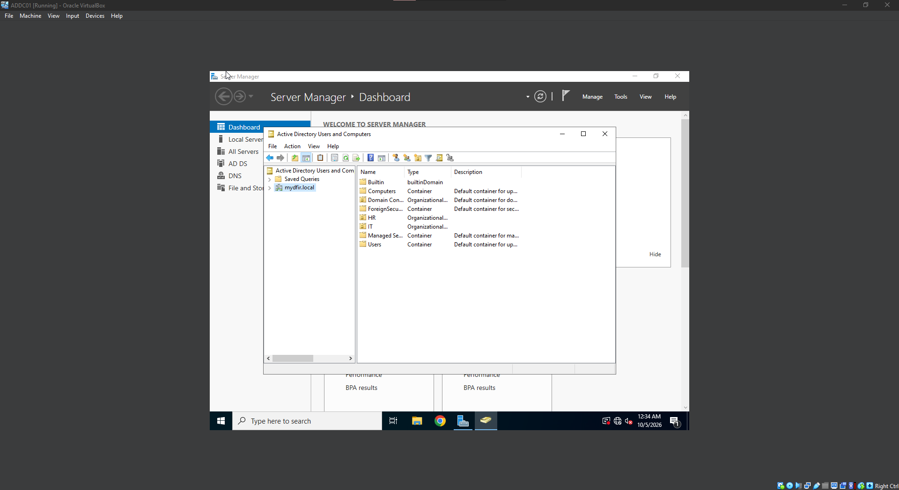
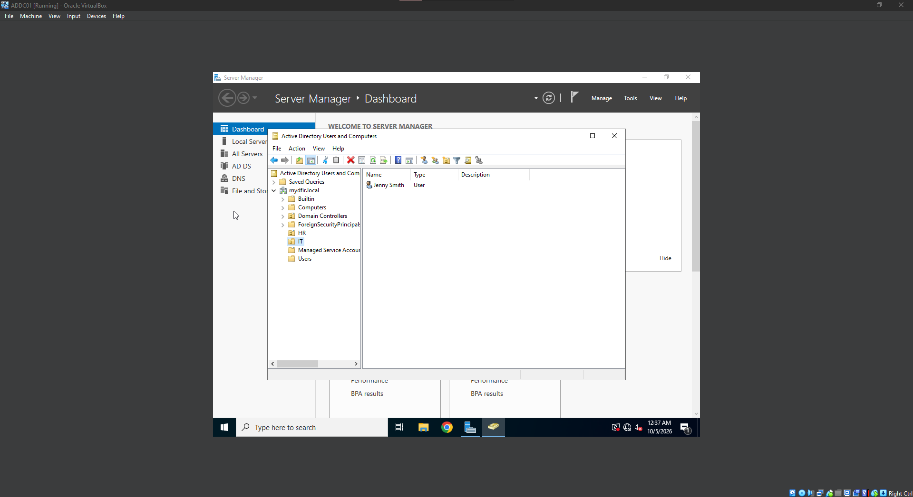
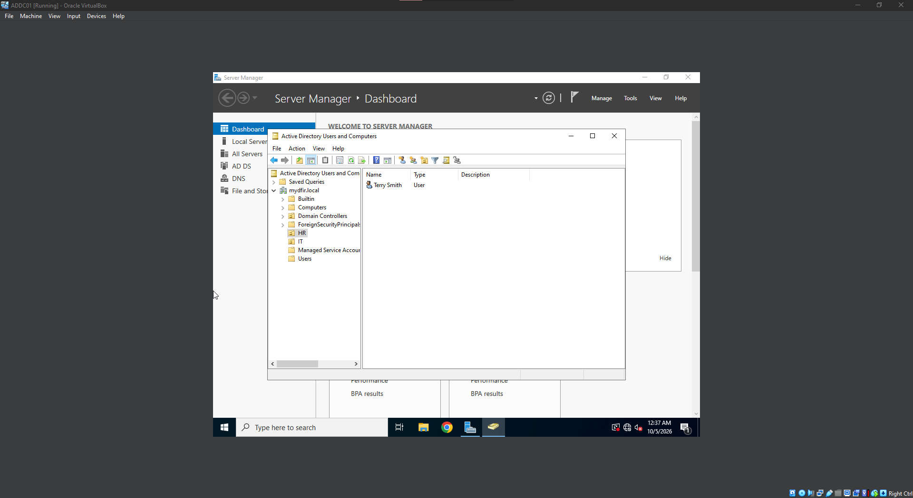
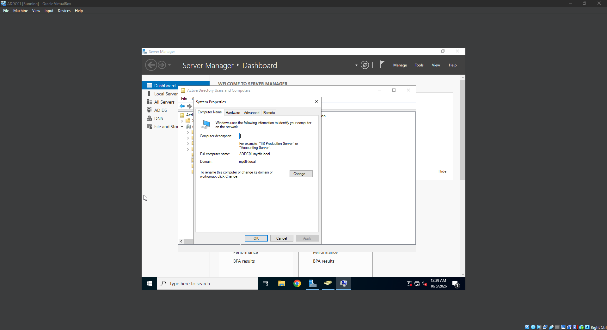
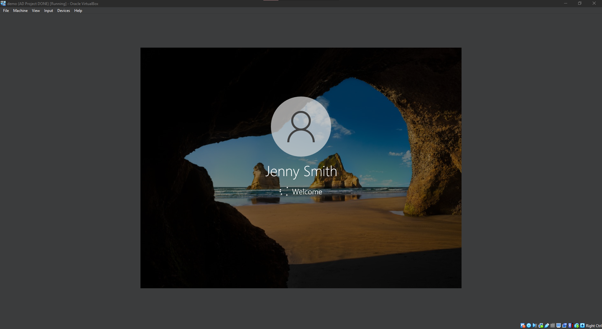

# 04: Active Directory Setup and Domain Join

## Goal
Install AD DS, promote the server to a domain controller, create users, and join the Windows 10 machine to the domain.

## Steps

### Domain Controller
- Set a static IP on ADDC01: `192.168.10.7`, mask `255.255.255.0`, gateway `192.168.10.1`
- Server Manager > Add Roles and Features > installed **Active Directory Domain Services**
- Promoted the server to a domain controller: **Add a new forest**, root domain `mydfir.local`
- Server restarted and I logged in as `MYDFIR\Administrator`

### Users and OUs
- Opened **Active Directory Users and Computers**
- Created Organizational Units: `IT` and `HR`
- Created users: Jenny Smith (`jsmith`) in IT and Terry Smith (`tsmith`) in HR

### Joining the Target PC
- Joining failed at first because the PC could not resolve `mydfir.local`. Fixed by pointing the PC's **DNS server to the domain controller (192.168.10.7)** instead of `8.8.8.8`
- Joined the domain via System Properties > Computer Name > Change
- Rebooted and logged in as `MYDFIR\jsmith`

## Screenshots
AD DS installed

Users and OUs

Domain join success

Logged in as domain user

## What I Learned
- AD is a database of objects (users, computers, groups) with attributes; the DC handles authentication (Kerberos) and authorization
- Domain-joined machines need DNS that can resolve the domain, which means pointing them at the DC
- The `NTDS.dit` file holds all AD data including password hashes, so it is a high-value target for attackers
- [Your own notes]
